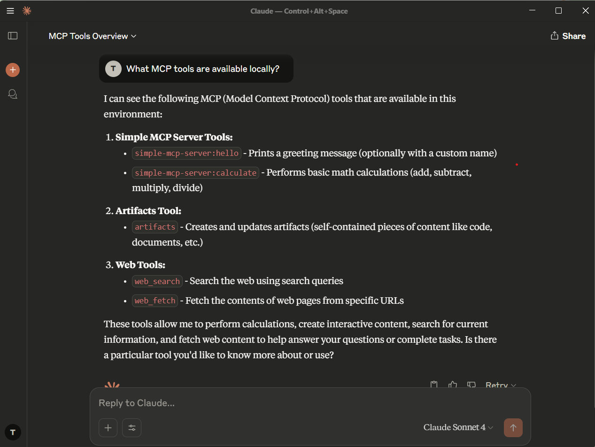

# My MCP Learning Project - Level 1 Summary

Documenting what I built and learned while exploring MCP (Model Context Protocol).

---

## 1. Understanding the Buzzwords

Had to wrap my head around all these terms first:

- **GenAI**: AI that generates stuff (text, code, whatever)
- **LLM**: The big language models like GPT, Claude
- **RAG**: When you give an LLM access to external data
- **Tool**: Functions the AI can call (like a calculator or API)
- **Agent**: AI that can use multiple tools to solve problems
- **MCP**: The protocol that lets AI tools talk to each other

### Tool vs Agent:
- **Tool**: Single-purpose function (calculator, weather API)
- **Agent**: Multi-tool orchestrator that plans and executes complex workflows

---

## 2. Open Agent Platform and Arcade Research

### Open Agent Platform by LangChain (OAP):
The Open Agent Platform (OAP) by LangChain is a no-code framework to build and orchestrate AI agents using the LangGraph engine. It allows users to define how agents think, plan, and act via a visual interface or by configuring LangGraph graphs. These agents can interact with external tools using a standardized protocol such as MCP. Key features include:

- **Visual orchestration** of agents and workflows
- **Tool and data integration** via LangChain-compatible plugins
- **Multi-agent workflows** using LangGraph
- **Authentication and deployment support** (local or cloud)
- **MCP-native** execution of agent tool actions

Agents in OAP are built using LangGraph’s REACT pattern and can be deployed with built-in tracing, retries, and state management. This platform is ideal for designing complex autonomous workflows for GenAI applications.

### Arcade AI:
Arcade is a tool execution engine that provides pre-built integrations (tools) which agents can call securely using MCP. It serves as the "tool engine" or "action provider" behind agents built on LangChain or any other orchestration layer.

- **Core Features**:
  - Tool registry with support for authenticated tools (Gmail, Slack, etc.)
  - User-specific permissions and secure API interaction
  - Standardized execution interface via MCP

- **Architecture**:
  - Centralized engine running an **MCP server**
  - Tools are written once and can be served to any LLM or agent platform
  - Developer-friendly CLI and SDK to register and invoke tools

Together, OAP + Arcade = full-stack GenAI development: agent design (LangGraph) + secure real-world actions (Arcade tools).

```
┌─────────────────────┐
│     AI Frontend     │
│ (OAP Web UI / API)  │
└────────┬────────────┘
         │ HTTP (user query)
         ▼
┌─────────────────────┐
│  LangGraph Agent     │  ← Defined in OAP
│ (LangChain Runtime) │
└────────┬────────────┘
         │
         │ MCP Tool Call
         ▼
┌─────────────────────┐
│    Arcade Engine     │  ← MCP Server
│ (Tool Execution Host)│
└────────┬────────────┘
         │
         │ Tool API Call (e.g. Gmail, Slack, Math)
         ▼
┌─────────────────────┐
│   External Services  │
│   or Custom Tools    │
└─────────────────────┘
```

---

## 3. Local Environment Setup

### Environment Details:
- **OS**: Windows 11
- **Python**: 3.x
- **IDE**: VS Code with GitHub Copilot
- **MCP Library**: mcp>=1.0.0
- **Web Framework**: Flask 2.0.0

### Setup Commands:
```bash
pip install -r requirements.txt
pip install mcp flask
python mcp_server.py  # Start MCP server
python web_ui.py      # Start web interface
```

---

## 4. MCP Tools Implemented

### Tool 1: Hello World
- **Function**: Greeting with customizable name
- **Input**: `{"name": "string"}` (optional)
- **Output**: "Hello, {name}! 👋"

### Tool 2: Calculator
- **Function**: Basic math operations
- **Input**: `{"operation": "add|subtract|multiply|divide", "a": number, "b": number}`
- **Output**: Calculation result with formatted string

---

## 5. Testing Results

### Direct Function Test:
```bash
python simple_test.py
```
✅ Both tools working correctly

### Web UI Test:
```bash
python web_ui.py
```
✅ Interface accessible at http://localhost:5000

### Protocol Test:
```bash
python test_client.py
```
✅ JSON-RPC communication established

---

## 6. Client Integration Status

### Tested Clients:
- **Web UI**: ✅ Fully functional
- **Direct Python**: ✅ Working
- **Claude Desktop**: ✅ wokring

---

## 7. Debugging Tools

#### 🛠 MCP Inspector
A powerful CLI tool for inspecting protocol behavior during MCP execution:
```bash
pip install mcp-inspector
mcp-inspector python mcp_server.py
```
- Real-time inspection of JSON-RPC tool calls
- Trace input/output and execution flow
- Essential for protocol-level bug tracing

#### 🔍 LangSmith (LangChain observability)
LangSmith helps track and visualize every step in a LangChain agent or LLM application:
```python
import os
os.environ["LANGCHAIN_TRACING_V2"] = "true"
os.environ["LANGCHAIN_API_KEY"] = "your-key"
```
- Visual tracing of chains, tools, retrievers
- Token and latency breakdowns
- Helpful for debugging tool call failures and agent planning issues

#### 📈 Sentry (Production Monitoring)
Best used for error reporting once tools or agents go live:
```python
import sentry_sdk
sentry_sdk.init(dsn="your-project-dsn")
```
- Captures exceptions with stack trace, variables, and context
- Tracks performance, regressions, and deployment health
- Great for ongoing reliability in GenAI production setups

---

## 8. Architecture Overview

```
┌─────────────────┐    ┌─────────────────┐    ┌─────────────────┐
│   AI Client     │    │   MCP Server    │    │     Tools       │
│  (Copilot/etc)  │◄──►│   (Protocol)    │◄──►│ (Hello/Calc)    │
└─────────────────┘    └─────────────────┘    └─────────────────┘
         │                       │                       │
         │              ┌─────────────────┐              │
         └──────────────►│    Web UI       │◄─────────────┘
                        │   (Flask)       │
                        └─────────────────┘
```

---

## 9. Key Files Created

- `mcp_server.py` - Main MCP server
- `web_ui.py` - Flask web interface
- `simple_test.py` - Direct function testing
- `test_client.py` - Protocol testing
- Configuration files for various AI clients

---

## 10. Next Steps for Level 2

- Implement more complex tools (file operations, API calls)
- Add RAG capabilities with vector databases
- Create multi-tool agents with planning
- Integrate with external services (OpenAI, Anthropic)
- Build workflow orchestration with Arcade

---

## 📸 Screenshots

### 1. Claude Interface

- **Claude UI Screenshot**  
  
  
#### Claude - MCP Tool Calls

- **Greeting Prompt (Claude MCP)**  
  

- **Greeting Response**  
  

- **Calculator Tool Prompt**  
  

### 3. Web Interface

- **Web UI for MCP Tools**  
  

---

## ✅ Conclusion

✅ **Level 1 Complete**: Basic MCP tools deployed and tested  
✅ **Environment**: Local setup functional  
✅ **Tools**: Hello and Calculator working  
✅ **Testing**: Multiple test methods available  
✅ **Debugging**: Professional tools explored
